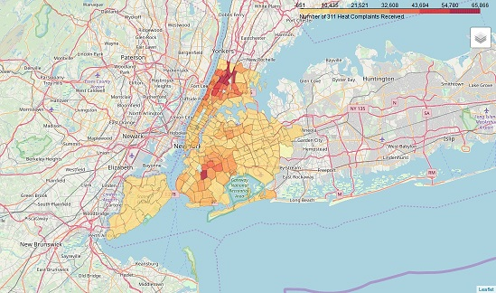

## Project 1: Data wrangling and modeling of NYC housing complaint data

This is a project started as the "Capstone" project for [IBM's Data Science professional certification](https://www.ibm.com/blogs/ibm-training/data-science-ibm-coursera/).  I added visualizations and incorporated more data sets to get more user-friendly answers.

### The project goal was to characterize the most important areas and type of housing complaints in the NYC area.

This involved the following data sets:
- The [311 Service Requests from 2010 to Present](https://data.cityofnewyork.us/Social-Services/311-Service-Requests-from-2010-to-Present/erm2-nwe9) from NYC Open Data
- The [PLUTO land use and building characteristics](https://www1.nyc.gov/site/planning/data-maps/open-data/dwn-pluto-mappluto.page) data set
- Geographic data from [data.gov](https://catalog.data.gov/dataset/zip-codes-zipcodes) and for the [folium](https://python-visualization.github.io/folium/) libraries for choropleth visualizations

The three specific questions the code addresses are:
- Question 1: Ingest and clean the 311 dataset to determine what type of housing complaints the city should prioritize
- Question 2: Locate and visualize complaint "hot spots" in the five boroughs using geographic data
- Question 3: Create a model to predict which building characteristics correlate with housing complaints using combined PLUTO and 311 data

## Project 2:
## Project 3: 

contact info:
